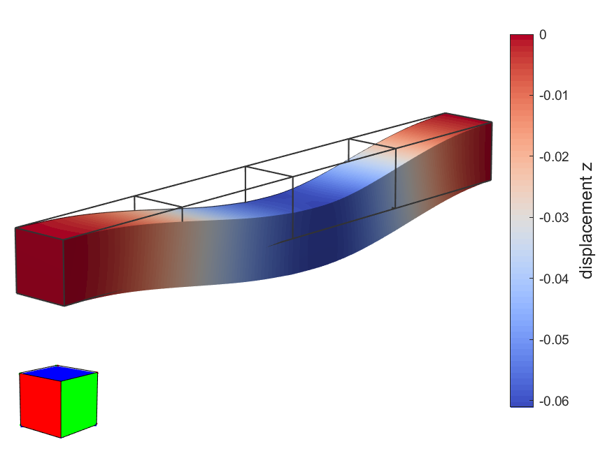

# Example: Beam with Multiple Regions

[← Back to README](../README.md)

This example reproduces the analysis of the beam with multiple regions described in Section 7.2 of [[1]](../README.md/#ref1). It is driven by the script `testBeam.m`, which reads a mesh, applies boundary conditions, runs the elastostatic solver, and visualizes the result with a `MeshInterface`.

```matlab
[mi, m] = testBeam;
```

- `mi` is the resulting `MeshInterface` object (already showing the deformed, color-mapped result);
- `m` is the `Material` used in the analysis.

## 1. Loading the mesh (with caching)

```matlab
name = 'tests/beam/beam';
filename = [name '.be'];
a = strcat(filename, '.mat');
solved = exist(a, 'file');
if solved
  a = load(a, 'mesh');
  mesh = a.mesh;
  clear a;
else
  mesh = readMesh(char(filename));
  mesh.name = 'beam';
  computeLoadPoints(mesh);
end
```

As in other examples, this script caches its own results: if `tests/beam/beam.be.mat` already exists, it is loaded directly (skipping the boundary-condition/solver steps below). Otherwise, the mesh is read from `tests/beam/beam.be` (no `'-f'` flag this time — this model does carry face data) and, unlike the tee/plate models, `computeLoadPoints(mesh)` is called explicitly to compute the load points needed by the solver (see the same step in the [cylinder example](cylinder-example.md)).

## 2. Opening the mesh interface and material

```matlab
mi = MeshInterface(mesh);
m = Material(1e5, 0.3);
```

Both the `MeshInterface` and the `Material` (Young's modulus `1e5`, Poisson's ratio `0.3`) are created regardless of whether the mesh was cached, since `mi` and `m` are the function's outputs.

## 3. Boundary conditions and solver (only if not cached)

```matlab
eid_ends = [3, 221];
eid_t1 = 198;
eid_t2 = 160;
eid_t3 = 107;
eid_t4 = 53;
% Constraints...
mi.selectRegions(eid_ends);
mi.makeConstraint('xyz', 0);
% ...and loads
t1 = 2;
t2 = 1;
t3 = 6;
t4 = 4;
mi.selectRegions(eid_t1);
mi.makeLoad([0, 0, +t1]);
mi.selectRegions(eid_t2);
mi.makeLoad([0, +t2, 0]);
mi.selectRegions(eid_t3);
mi.makeLoad([0, 0, -t3]);
mi.selectRegions(eid_t4);
mi.makeLoad([0, -t4, 0]);
mi.deselectAllElements;
```

- `mi.selectRegions(eid_ends)` selects both end regions of the beam (seed elements `3` and `221`), which are then fully clamped with `mi.makeConstraint('xyz', 0)` — the beam is fixed at both ends;
- four separate regions along the beam (`eid_t1`…`eid_t4`) each receive a uniform load, alternating between the `y` and `z` directions and between positive and negative signs (magnitudes `t1=2`, `t2=1`, `t3=6`, `t4=4`), simulating a beam loaded at multiple points along its length in different transverse directions;
- `mi.deselectAllElements` clears the selection afterwards.

```matlab
solver = ElastostaticSolver(mesh, m);
solver.set('srMethod', 'TR');
solver.set('minRatio', 1);
solver.execute();
save(a, 'mesh');
```

The solver is configured and run exactly as in the other examples (see the [cylinder example](cyilinder-example.md) for the caveats about `ElastostaticSolver`), and the solved mesh is cached to `tests/beam/beam.be.mat` for future runs.

## 4. Visualizing the result (Figure 30(b) of [[1]](../README.md/#ref1))

```matlab
mi.setView(132, 15);
mi.showPatchEdges(false);
mi.deformMesh(100);
mi.setUndeformedMeshAlpha(0);
mi.setScalars('u', 'z');
mi.setColorTable(coolWarm);
mi.showColorMap;
mi.showColorBar;
```

- `mi.setView(132, 15)` sets a custom camera angle (azimuth `132°`, elevation `15°`) chosen to match the paper's figure;
- `mi.showPatchEdges(false)` hides the tessellation edges;
- `mi.deformMesh(100)` shows the mesh deformed by the computed displacements, exaggerated by a factor of 100;
- `mi.setUndeformedMeshAlpha(0)` makes the undeformed-mesh overlay fully transparent — a subtler alternative to `showUndeformedMesh(false)`, since the overlay stays technically "shown" but invisible;
- `mi.setScalars('u', 'z')` maps only the `z` component of the displacement (not its magnitude, unlike the previous examples) to the scalar field;
- `mi.setColorTable(coolWarm)` / `mi.showColorMap` / `mi.showColorBar` turn on the `coolWarm`-colored map and its color bar (see the [`MeshInterface` manual](MeshInterface.md), §5.5).

The window now reproduces Figure 30(b): the deformed beam, viewed from a custom angle and colored by the `z` displacement component.

<p align="center">
  <br>
  Deformed beam colored by z displacement.
</p>
