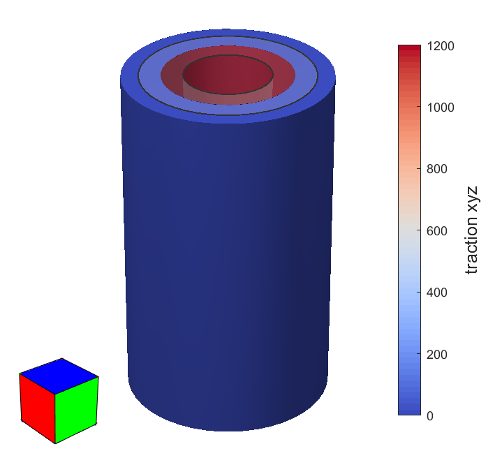

# Example: Pressurized Hollow Cylinder

[← Back to README](../README.md)

This example reproduces the analysis of a hollow cylinder subjected to an internal pressure, as described in Section 7.1 of [[1]](../README.md/#ref1). It is driven by the script `testCylinder.m`, which reads (or loads a cached) mesh, applies a boundary condition on the inner surface, runs the elastostatic solver, and visualizes the result with a `MeshInterface`.

```matlab
[mi, m] = testCylinder(idx);
```

- `idx` selects one of four available mesh resolutions;
- `mi` is the resulting `MeshInterface` object (already showing the deformed, color-mapped result);
- `m` is the `Material` used in the analysis.

## 1. Choosing a mesh resolution

The script ships with four pre-generated meshes of the same cylinder, at increasing resolution:

| `idx` | File | Elements |
|---|---|---|
| 1 | `cylinder96.be` | 96 |
| 2 | `cylinder144.be` | 144 |
| 3 | `cylinder216.be` | 216 |
| 4 | `cylinder384.be` | 384 |

All files are expected under `tests/cylinder/`. Calling `testCylinder()` with no argument just prints the function's help.

## 2. Loading the mesh (with caching)

```matlab
filename = strcat(folder, filenames(idx));
a = strcat(filename, '.mat');
solved = exist(a, 'file');
if solved
  a = load(a, 'mesh');
  mesh = a.mesh;
  clear a;
else
  mesh = readMesh(char(filename));
  mesh.name = filenames(idx);
  computeLoadPoints(mesh);
end
```

As in other examples, this script caches its own results: if a `.mat` file matching the chosen resolution (e.g. `tests/cylinder/cylinder96.be.mat`) already exists, it is loaded directly (`mesh` then already carries the boundary condition and computed results from a previous run), and the boundary-condition/solver steps below are skipped entirely. Otherwise, the mesh is read from the corresponding `.be` file with `readMesh` (see the [`MeshInterface` manual](MeshInterface.md) for details on this function), given a name matching its source file, and `computeLoadPoints(mesh)` computes the load points required by the elastostatic solver.

## 3. Opening the mesh interface and material

```matlab
mi = MeshInterface(mesh);
m = Material(1e5, 0);
```

Both the `MeshInterface` and the `Material` (Young's modulus `1e5`, Poisson's ratio `0`) are created regardless of whether the mesh was cached, since `mi` and `m` are the function's outputs.

## 4. Applying the boundary condition and solving (only if not cached)

```matlab
u = -0.01;
mi.selectRegions(fid(idx));
mi.makeConstraint('xyz', u, 'direction', 'normal');
mi.deselectAllElements;
```

- `mi.selectRegions(fid(idx))` selects the entire region on the mesh whose seed element has ID `fid(idx)` — the ID varies with the mesh resolution (`fid = [58, 71, 134, 243]`) because it must always point to an element on the **inner** surface of the cylinder;
- `mi.makeConstraint('xyz', u, 'direction', 'normal')` prescribes, on every node of the selected region, a displacement of `u = -0.01` along the local surface normal for all three dofs (`'xyz'`) — i.e., a uniform inward radial displacement, which is how the internal pressure loading is imposed on this model;
- `mi.deselectAllElements` clears the selection afterwards, purely for a clean view (it does not affect the constraint already created).

```matlab
solver = ElastostaticSolver(mesh, m);
solver.set('srMethod', 'TR');
solver.set('minRatio', 1);
solver.execute;
save(a, 'mesh');
```

The solver is configured and run (see [[1]](../README.md/#ref1) and [QuadIntegrator.m](../bea/QuadIntegrator.m) for the full set of options), and the solved mesh is cached to the `.mat` file matching the chosen resolution for future runs.

## 5. Visualizing the result (Figure 25(a) of [[1]](../README.md/#ref1))

```matlab
mi.deformMesh(25);
mi.setScalars('t', 'xyz');
mi.setColorTable(coolWarm);
mi.showColorMap;
mi.showColorBar;
...
```

- `mi.deformMesh(25)` displays the mesh deformed by the computed displacements, exaggerated by a factor of 25 for visualization;
- `mi.setScalars('t', 'xyz')` maps the magnitude of the traction vector (all three components) to a scalar field;
- `mi.setColorTable(coolWarm)` switches the color map palette to `coolWarm` (a custom colormap function used throughout the paper's figures, not part of `MeshInterface` itself);
- `mi.showColorMap` / `mi.showColorBar` turn on the color-mapped rendering and its color bar (see the [`MeshInterface` manual](MeshInterface.md), §5.5).

This step always runs, whether or not the mesh was freshly solved, so the window reproduces Figure 25(a) — the deformed cylinder, colored by traction magnitude — every time the script is called.

<p align="center">
  <br>
  Deformed cylinder colored by traction magnitude.
</p>

## 6. Peeking at the undeformed cross-section

```matlab
mi.hidePatches;
mi.showPatchEdges(false);
```

As noted in the script's comments, selecting a few elements from the outer and inner surfaces before calling `mi.hidePatches` hides just those elements, opening a "window" into the cylinder's wall — useful for inspecting the undeformed mesh overlay (`mi.showUndeformedMesh(true)`) from the inside. `mi.showPatchEdges(false)` then hides the tessellation edges for a cleaner view. This step also always runs, regardless of caching.
