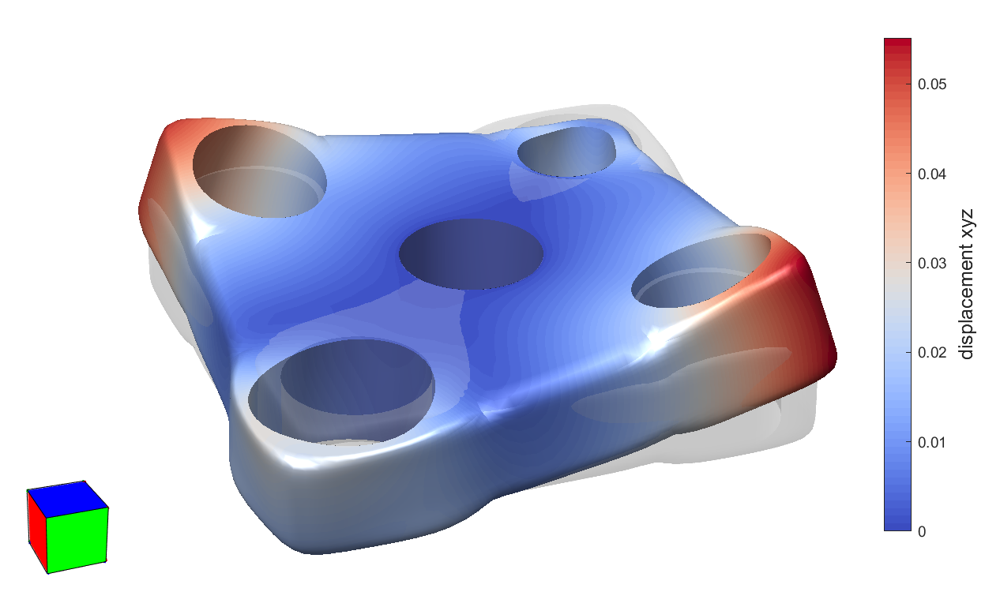

# Example: Thick Plate with Holes

[← Back to README](../README.md)

This example reproduces the analysis of the thick plate with holes described in Section 7.2 of [[1]](../README.md/#ref1). It is driven by the script `testPlate.m`, which reads a mesh, applies boundary conditions, runs the elastostatic solver, and visualizes the result with a `MeshInterface`.

```matlab
[mi, m] = testPlate;
```

- `mi` is the resulting `MeshInterface` object (already showing the deformed, color-mapped result);
- `m` is the `Material` used in the analysis.

## 1. Loading the mesh (with caching)

```matlab
name = 'tests/plate/plate';
filename = [name '.be'];
a = strcat(filename, '.mat');
solved = exist(a, 'file');
if solved
  a = load(a, 'mesh');
  mesh = a.mesh;
  clear a;
else
  mesh = readMesh('-f', char(filename));
  mesh.name = 'plate';
end
```

As in the tee example, this script caches its own results: if `tests/plate/plate.be.mat` already exists, it is loaded directly (skipping the boundary-condition/solver steps below); otherwise the mesh is read from `tests/plate/plate.be` with the `'-f'` flag (model generated without element face data).

## 2. Opening the mesh interface and material

```matlab
mi = MeshInterface(mesh);
m = Material(210e3, 0.3);
```

Both the `MeshInterface` and the `Material` (Young's modulus `210e3`, Poisson's ratio `0.3`) are created regardless of whether the mesh was cached, since `mi` and `m` are the function's outputs.

## 3. Boundary conditions and solver (only if not cached)

```matlab
eid_h1 = 9;
eid_h2 = 117;
eid_h3 = 141;
eid_h4 = 69;
eid_hc = 21;
% Constraints...
mi.selectRegions(eid_hc);
mi.makeConstraint('xyz', 0);
% ...and loads
mi.selectRegions(eid_h1);
mi.makeLoad(-1000, 'direction', 'normal');
mi.selectRegions(eid_h3);
mi.makeLoad(+1000, 'direction', 'normal');
mi.selectRegions([eid_h2 eid_h4]);
mi.makeLoad([0 0 100]);
mi.deselectAllElements;
```

The plate has five holes, each identified by a seed element used with `selectRegions`:

- `eid_hc` (center hole) is fully clamped: `mi.makeConstraint('xyz', 0)` sets zero displacement in x, y and z;
- `eid_h1` receives an inward pressure load: `mi.makeLoad(-1000, 'direction', 'normal')` — a scalar evaluator of `-1000` projected onto the local surface normal (see the [`MeshInterface` manual](MeshInterface.md), §5.9, on the `'direction'` option; this is equivalent to the shorthand `mi.makeLoad('pressure', -1000)`);
- `eid_h3` receives the opposite, an outward pressure of `+1000` along the normal;
- `eid_h2` and `eid_h4` receive the same uniform out-of-plane load `[0 0 100]` (recall `makeLoad`'s evaluator always supplies the full 3D traction directly, with no separate `dofs` argument);
- `mi.deselectAllElements` clears the selection afterwards.

```matlab
solver = ElastostaticSolver(mesh, m);
solver.set('srMethod', 'TR');
solver.set('minRatio', 1);
solver.execute();
save(a, 'mesh');
```

The solver is configured and run exactly as in the [cylinder example](cylinder-example.md), which also covers the caveats about `ElastostaticSolver`. The solved mesh is then cached to `tests/plate/plate.be.mat` for future runs.

## 4. Visualizing the result (Figure 34(b) of [[1]](../README.md/#ref1))

```matlab
mi.deformMesh(15);
mi.setScalars('u', 'xyz');
mi.setColorTable(coolWarm);
mi.showColorMap;
mi.showColorBar;
mi.showPatchEdges(false);
mi.setView(160, 30);
...
```

- `mi.deformMesh(15)` shows the mesh deformed by the computed displacements, exaggerated by a factor of 15;
- `mi.setScalars('u', 'xyz')` maps the magnitude of the displacement vector (all three components) to a scalar field;
- `mi.setColorTable(coolWarm)` / `mi.showColorMap` / `mi.showColorBar` turn on the `coolWarm`-colored map and its color bar (see the [`MeshInterface` manual](MeshInterface.md), §5.5);
- `mi.showPatchEdges(false)` hides the tessellation edges for a cleaner view.

The window now reproduces Figure 34(b): the deformed plate, colored by displacement magnitude.

<p align="center">
  <br>
  Deformed plate colored by displacement magnitude.
</p>
