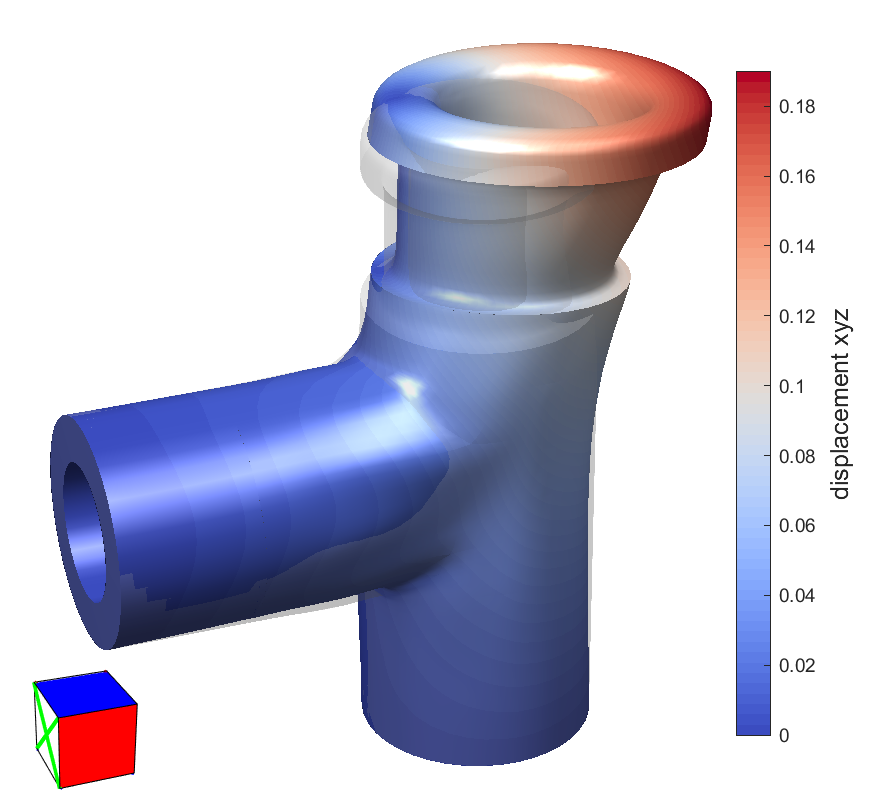

# Example: Tee-Shaped Model Under Torque and Uniform Load

[← Back to README](../README.md)

This example reproduces the analysis of the tee-shaped model described in Section 7.2 of [[1]](../README.md/#ref1). It is driven by the script `testTee.m`, which reads a mesh, applies boundary conditions, runs the elastostatic solver, and visualizes the result with a `MeshInterface`.

```matlab
[mi, m] = testTee;
```

- `mi` is the resulting `MeshInterface` object (already showing the deformed, color-mapped result);
- `m` is the `Material` used in the analysis.

## 1. Loading the mesh (with caching)

```matlab
name = 'tests/tee/tee';
filename = [name '.be'];
a = strcat(filename, '.mat');
solved = exist(a, 'file');
if solved
  a = load(a, 'mesh');
  mesh = a.mesh;
  clear a;
else
  mesh = readMesh('-f', char(filename));
  mesh.name = 'tee';
end
```

As in other examples, this script caches its own results: if `tests/tee/tee.be.mat` already exists, it is loaded directly (`mesh` then already carries the boundary conditions and computed results from a previous run), and the boundary-condition/solver steps below are skipped entirely. Otherwise, the mesh is read from `tests/tee/tee.be` with the `'-f'` flag, since this particular model was generated without element face data (see the [`MeshInterface` manual](MeshInterface.md) for details on `readMesh`).

## 2. Opening the mesh interface and fixing normals

```matlab
mi = MeshInterface(mesh);
mi.flipVertexNormals;
```

This step always runs, whether or not the mesh was freshly solved. The T-spline surface of this particular model was authored with clockwise orientation; calling `flipVertexNormals` with no arguments flips the normals of the whole mesh (since no elements are selected yet, it falls back to the mesh's outer shell), fixing the resulting inside-out shading.

## 3. Material

```matlab
m = Material(210e3, 0.3);
```

Creates the material used in the analysis (Young's modulus `210e3`, Poisson's ratio `0.3` — typical of steel). This is created regardless of whether the mesh was cached, since the returned `m` is part of the function's output.

## 4. Boundary conditions and solver (only if not cached)

```matlab
eid_front = 560;
eid_top = 322;
eid_bottom = 571;
% Loads...
mi.selectRegions(eid_top);
mi.makeLoad('torque', [0 0 0], [0 0 1], 20);
mi.makeLoad([0 20 0]);
% ...and constraints
mi.selectRegions([eid_front eid_bottom]);
mi.makeConstraint('xyz', 0);
mi.deselectAllElements;
```

- `mi.selectRegions(eid_top)` selects the top region of the tee (seeded by element `322`);
- `mi.makeLoad('torque', [0 0 0], [0 0 1], 20)` applies a torque load to that region: about an axis passing through `[0 0 0]` with direction `[0 0 1]` and scale `20` (see `Load.m` — internally this builds the load field `F(P) = 20 * ([0 0 1] × r)`, where `r` is the component of `P` perpendicular to the axis, applied along all three components regardless of any `'direction'` argument);
- `mi.makeLoad([0 20 0])` adds a *second*, independent load on the same region: a uniform load of `[0 20 0]` (recall `makeLoad` has no `dofs` argument — a load's evaluator always supplies the full 3D traction, or a scalar to be projected via `'direction'`, as covered in the [`MeshInterface` manual](MeshInterface.md), §5.9). Both loads accumulate on the top region;
- `mi.selectRegions([eid_front eid_bottom])` selects the front and bottom regions, which are then fully clamped with `mi.makeConstraint('xyz', 0)` (zero displacement in x, y and z);
- `mi.deselectAllElements` clears the selection afterwards.

```matlab
solver = ElastostaticSolver(mesh, m);
solver.set('srMethod', 'TR');
solver.set('minRatio', 1);
solver.execute;
save(a, 'mesh');
```

The solver is configured and run exactly as in the [cylinder example](cylinder-example.md), which also covers the caveats about `ElastostaticSolver`. The solved mesh is then cached to `tests/tee/tee.be.mat` for future runs.

## 5. Visualizing the result (Figure 33(a) of [[1]](../README.md/#ref1))

```matlab
mi.deformMesh(50);
mi.setScalars('u', 'xyz');
mi.setColorTable(coolWarm);
mi.showColorMap;
mi.showColorBar;
mi.showPatchEdges(false);
...
```

- `mi.deformMesh(50)` shows the mesh deformed by the computed displacements, exaggerated by a factor of 50;
- `mi.setScalars('u', 'xyz')` maps the magnitude of the displacement vector (all three components) to a scalar field;
- `mi.setColorTable(coolWarm)` / `mi.showColorMap` / `mi.showColorBar` turn on the `coolWarm`-colored map and its color bar (see the [`MeshInterface` manual](MeshInterface.md), §5.5);
- `mi.showPatchEdges(false)` hides the tessellation edges for a cleaner view.

The window now reproduces Figure 33(a): the deformed tee, colored by displacement magnitude.

<p align="center">
  <br>
  Deformed tee colored by displacement magnitude.
</p>
